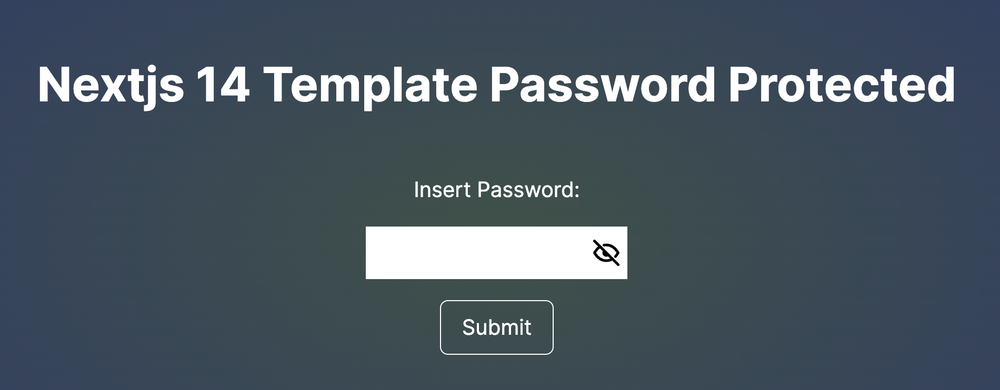
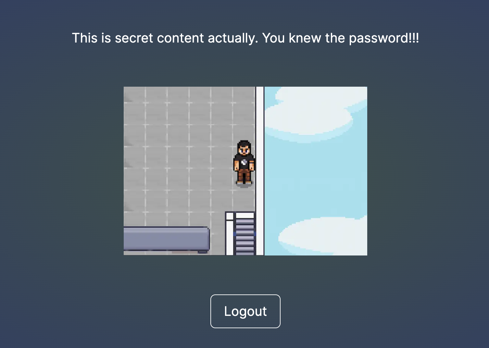

# Template Nextjs 14 Password Protect

Greatly inspired by this [Medium post](https://medium.com/@ziyafenn/password-protect-page-in-nextjs-5820cd7078ae) written by Ziya Fenn

## ⭐️ What is this and how to use it

Sometimes we have some situations where we want to share something interesting with someone by sending a link, but we don't want the content to be accessible to all users. Using .htaccess might be a solution in some cases, but for a quicker option that's already integrated into the page, we can utilize some handy features of `Next.js` along with the `cookie` npm package.

This template offers:

- 🔒 A password-protected route. Refer to the example in the `.env.example` file. In the [live example](https://nextjs-password-protect.vercel.app/), the password to access the main content is msweb.
- 🍪 Upon entering the password, a cookie is stored in the browser so that re-entering the password is unnecessary (unless you log out or manually delete your cookies).
- 🔗 Additionally, it's possible to link directly to the password-protected content by appending a query with the password, like `?password=msweb`, as shown in https://nextjs-password-protect.vercel.app?password=msweb. Note that both the password and the 'msweb' part are fully customizable in the .env.example. Upon using this link, the secret content will be displayed automatically.

 

To make this template work, just clone/fork/use it as a template, and create a `.env.local` out of the `.env.example`. I have been using `Node 18` without any single problem.

## ✉️ Contact

- [Manuel Sánchez](https://github.com/manuelsanchezweb)
